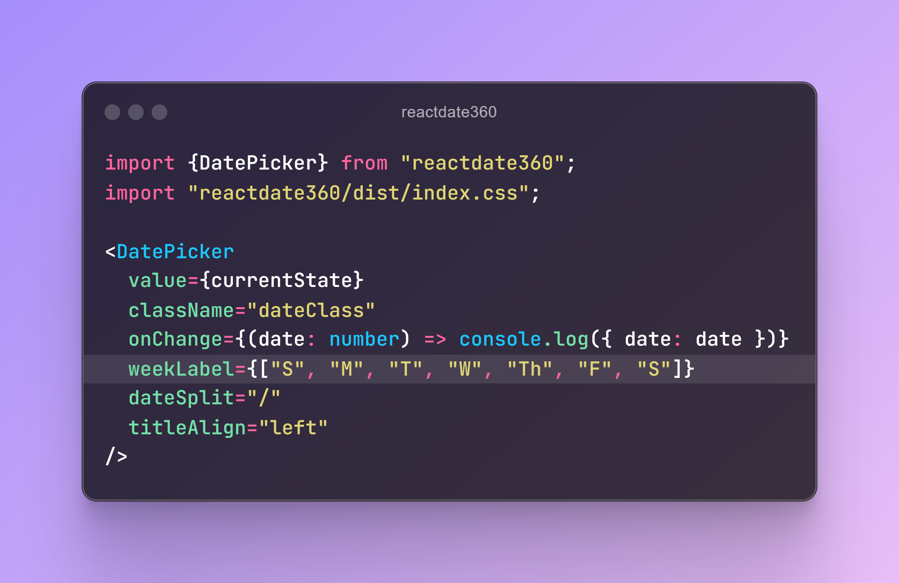
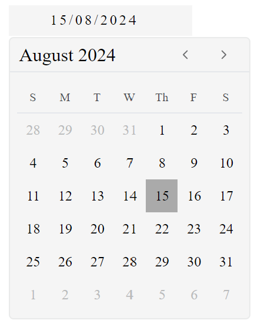
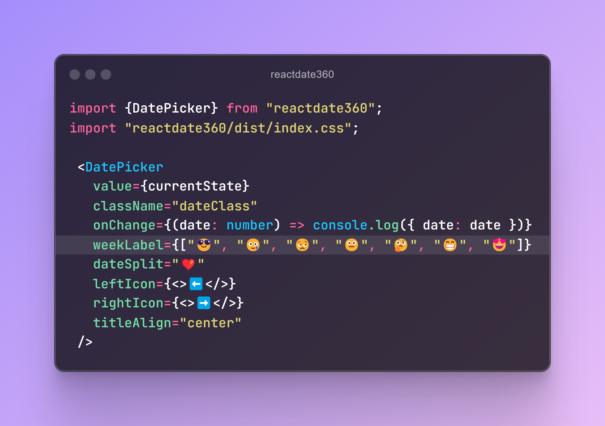
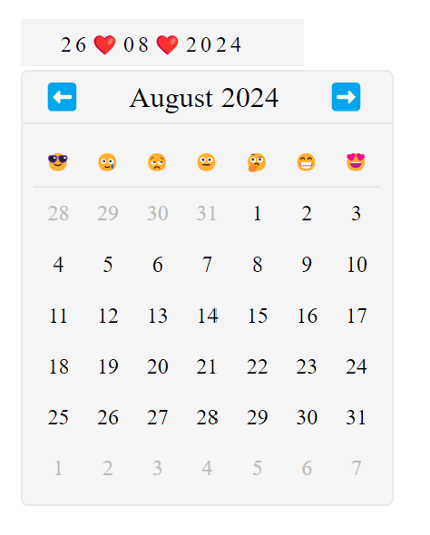
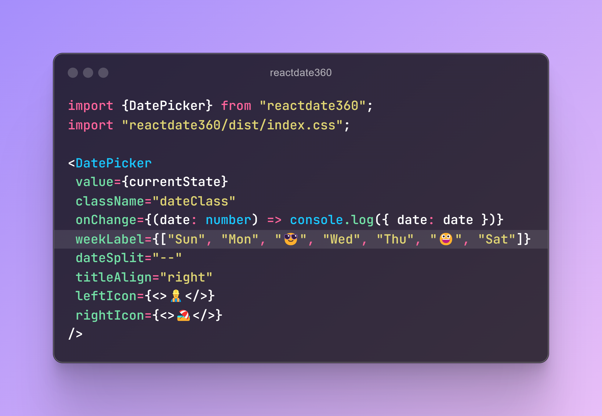
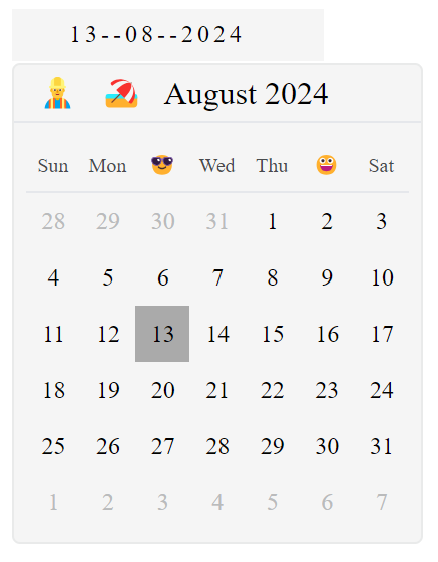
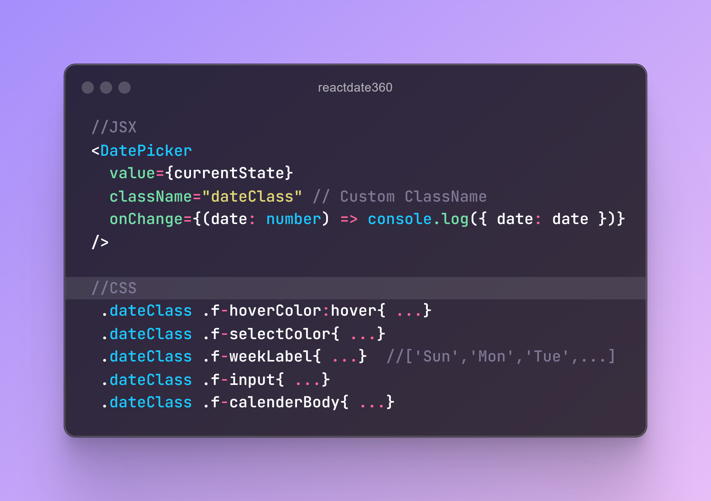
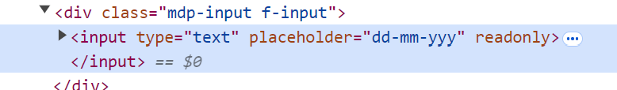

# react-date360

react-date360 is a flexible and customizable date picker component for React. Unlike other date picker components in frameworks like Material-UI, react-date360 allows you to fully modify icons, styles, and alignment to fit your needs.

## Installation
Install the package via npm:
```bash
npm install react-date360

```
## Usage
Here's a basic example of how to use react-date360:

```bash
import React, { useState } from "react";
import DatePicker from "react-date360";
import "react-date360/dist/index.css"

const App = () => {
  const [formValues, setFormValues] = useState({ date: null });

  return (
    <DatePicker
      value={formValues?.date}
      className="dateClass"
      onChange={(date: number) => setFormValues({ date: date })}
      weekLabel={["Sun", "Mon", "Tue", "Wed", "Thu", "Fri", "Sat"]}
      dateSplit="/"
      titleAlign="center"
      leftIcon={<>⬅️</>}
      rightIcon={<>➡️</>}
    />
  );
};

```
## Features
- Customizable Icons: Easily change the left and right icons for the date input.
- Flexible Styling: Apply your own styles and classes to the date picker.
- Alignment Options: Customize the alignment of the date picker title.
- Weekday Labels: Modify weekday labels to fit your preferences.
- 
- Flexible Styling: Apply your own styles and classes to the date picker.
- Alignment Options: Customize the alignment of the date picker title.
- Weekday Labels: Modify weekday labels to fit your preferences.
- Date Format: Choose your own date separator.


## Screenshots




## Target CSS using Classname



## License

[MIT](https://choosealicense.com/licenses/mit/).

## Contributing

Contributions are welcome! Please feel free to submit a pull request or open an issue.
